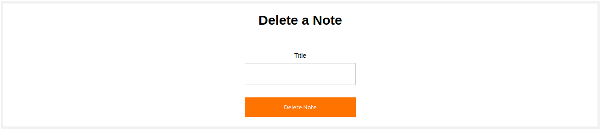

# Great Notes
## Table of Contents
- [Great Notes](#great-notes)
	- [Table of Contents](#table-of-contents)
	- [System Description](#system-description)
		- [Database](#database)
	- [Execution](#execution)
	- [The System in Detail](#the-system-in-detail)
		- [System Pages](#system-pages)
			- [Log-In Page](#log-in-page)
			- [Register Page](#register-page)
			- [User Page](#user-page)
			- [Admin Password Change Page](#admin-password-change-page)
			- [Admin Page](#admin-page)
			- [Search Page](#search-page)
		- [User Functions](#user-functions)
			- [Note Assignment](#note-assignment)
			- [Search Note via Title](#search-note-via-title)
			- [Search Note via Key Word](#search-note-via-key-word)
			- [Updating a Note](#updating-a-note)
			- [Deleting a Note](#deleting-a-note)
			- [Show all Notes in Chronological Order](#show-all-notes-in-chronological-order)
			- [Deleting an Account](#deleting-an-account)
		- [Administrator Functions](#administrator-functions)
			- [Assignment of a new Administrator](#assignment-of-a-new-administrator)
			- [Deleting a User](#deleting-a-user)
		- [Clarifications](#clarifications)

## System Description
The system on which GreatNotes is built uses MongoDB, Docker and Flask technologies, i.e. it is based on a pair of containers that include the database and the web application.

### Database
The <b>DigitalNotes</b> Database includes two collections:

<b>Users Collection:</b>
| name | email | password | category |
|------|-------|----------|----------|
|string|string | string   | string   |

<b>Notes Collection:</b>
| title | keywords | note | created |
|-------|----------|------|---------|
|string |  string  |string| datetime|


## Execution
To execute the program you <b>MUST</b> navigate to the <b>Great Notes</b> folder and run the command:

```bash
sudo docker-compose up --build
```

## The System in Detail

### System Pages

#### Log-In Page
This page is the first page a user encounters and allows him/her to log in either as a User or as an Admin. There is also a link on the page to the registration page if and when the user wishes to create a new account. There are two Users and one Admin in the system from the outset.

<center></center>

#### Register Page
On the registration page a user is able to register to the system, having the role of a simple user (User) and not an administrator (Admin). After registration the user is directed to the login page.

<center></center>

#### User Page
On this page, the user is guided after successfully logging in to the system and all the features that the user has as a user are displayed, which we will see in detail below. At the top right there is a button (Log-Out) that allows the user to log out.

<center></center>

####  Admin Password Change Page
The administrator is guided to this page after the successful login to the system and is shown an HTML Form which he is required to fill in with the email which he logged in and is registered, but also with a new password as based on the pronunciation of the task, the administrator is required to change his password with each login.

<center></center>

#### Admin Page
The administrator is led to this page after successfully changing the password of the page (Admin Password Change Page) and then all the features that he has as an administrator are displayed, which we will see in detail below. At the top right there is a button (Log-Out) that allows the administrator to log out.

<center></center>

#### Search Page
The user is taken to this page after performing either the search by title, or the search by keyword, or the display of all the notes in chronological order. This page displays the searched notes each time. At the top right is a button (Back) that allows the individual user or administrator to return to their main page.

<center></center>

### User Functions

#### Note Assignment
The User can enter the title, keywords, and the note itself, so that a new note can be assigned to the DigitalNotes database.

<center></center>

#### Search Note via Title
The User has the possibility to enter the title of a note and it will take us to a new page (Search Page) with all the information of this note. 

<center></center>

#### Search Note via Key Word
The User has the possibility to enter a keyword and it will take us to a new page (Search Page) with all the information of this note or notes. Finding the keyword within the many that a note may have is done with the help of Python RegEx.

<center></center>

#### Updating a Note
Here the User can enter the title of a note, and then the new variable values of a note, in order to update an existing note in the DigitalNotes database.

<center></center>

#### Deleting a Note
The User may enter the title of a note if and when he/she intends to delete the existing note from the DigitalNotes database.

<center></center>

#### Show all Notes in Chronological Order
By pressing a button the User has the possibility to be led to a new page (Search Page) which will contain all the notes with their information in chronological order, with the help of the *.sort()* function.

<center></center>

#### Deleting an Account
Finally, the User has the option to delete his account by pressing a button and then be taken to the Log-In Page.

<center></center>

### Administrator Functions

#### Assignment of a new Administrator
By entering the name, email, and a password of a suspected administrator, the Admin is able to enter him/her as an administrator in the Users collection of the DigitalNotes database.

<center></center>

#### Deleting a User
Eventually, the Admin has the authority to delete the account of any user by including their name in the Users collection of the DigitalNotes database.

<center></center>

### Clarifications
The .html files each have their own css and code that allows through the use of Python Flask Flash the display of messages and various errors in case of searching for a non-existent note for example. The .py archives have been divided into 4 different ones depending on the "tasks" that each one has to perform so as not to complicate everything. The requirements.txt file has been created using the command:

```bash
python3 -m pip freeze > requirements.txt
```

Lastly, the notes.json and users.json files assigned to the base creation using Dockerfile and app.py have been populated with variables of my liking.

Access GreatNotes: http://0.0.0.0:5000/authentication/signIn
